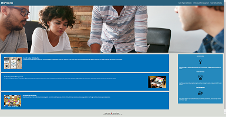
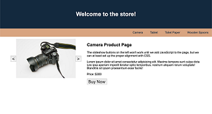

# Professional-Portfolio

01-HTML-Git-CSS
## Table of Contents
1. [Description](#Description)
2. [Visuals](#visuals)

## Description
This website is my coding boot camp profile. It is a page that features what I am about, my work, contact information, and resume.
[Link to live site](https://theodoreshishkovskiy.github.io/Professional-Portfolio/)

## Visuals

